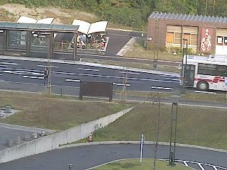

# Movement Detection with SVD

This project demonstrates a Singular Value Decomposition (SVD)-based algorithm for detecting moving objects (specifically buses) in surveillance video frames. The approach leverages SVD properties to extract frames with movement, separate background from foreground, and classify detected buses by their direction.

## Dataset

The dataset is provided by the Laboratory for Image and Media Understanding, Kyushu University, Japan ([LIMU Dataset](https://limu.ait.kyushu-u.ac.jp/dataset/en/)). The main focus is on the **Bus Stop in the Morning** sequence, which contains 5000 frames from a static surveillance camera. All images are processed in grayscale for simplicity.

Sample image from the dataset:

## Project Phases

The study is divided into three main phases:

1. **Frame Extraction**  
   Using a sliding window and SVD, the algorithm identifies frames where a bus is present by analyzing the ratio of the second to the first singular value. Local maxima in this ratio indicate significant movement.

2. **Background Removal**  
   SVD is applied to a stack of frames with minimal movement to estimate the static background. The background is subtracted from detected frames to isolate the moving bus (foreground).

3. **Bus Direction Classification**  
   The left singular vectors from SVD (specifically the first column of U) are used as features for KMeans clustering, classifying buses by their direction of travel.

## Methodology

- **Sliding Window SVD:**  
  For each window of k frames, images are flattened and stacked. SVD is performed, and the ratio of singular values is used to detect movement.

- **Background Separation:**  
  A rank-1 approximation from SVD is used to estimate the background. Subtracting this from a detected frame isolates the bus.

- **Clustering:**  
  KMeans clustering is applied to the singular vectors to group buses by direction. Performance is evaluated using F1 score, confusion matrix, and silhouette score.

## Results

- **Detection:**  
  The algorithm successfully detects frames containing buses by identifying peaks in the singular value ratio.

- **Background Removal:**  
  The background is effectively separated, allowing clear isolation of the bus in the foreground.

- **Classification:**  
  - **Morning Dataset:** High accuracy with only 2 misclassifications out of 27 cases.
  - **Evening Dataset:** 100% accuracy.
  - **Silhouette Score:** 0.14, indicating clusters are not well-separated, but classification accuracy remains high.

## Conclusion

This SVD-based approach provides an effective pipeline for movement detection, background separation, and direction classification in surveillance video. The method is robust and can be extended to RGB images for improved performance.

For further details, refer to the notebook `HW_3_Fassio.ipynb` for code and step-by-step explanations.
